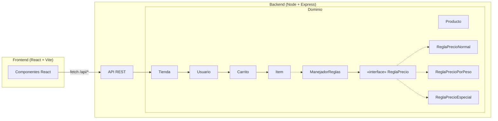
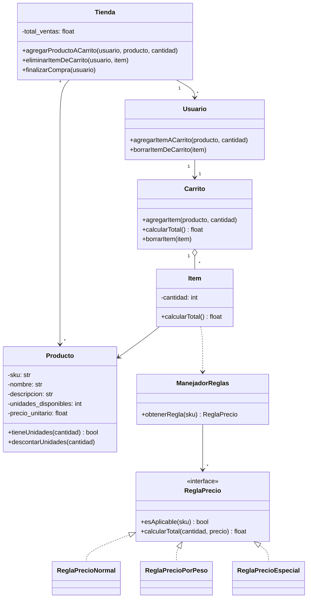

# 🛒 Tienda App — Diseño e Implementación de Aplicación Web

Aplicación de comercio electrónico desarrollada como solución al caso de estudio de **Diseño de Software**, que traduce a una arquitectura cliente-servidor moderna un modelo orientado a objetos centrado en el patrón **Strategy** para el cálculo de precios.

> 🎥 Video de sustentación: *[agregar enlace aquí]*

---

## 📋 Tabla de contenido

- [El problema](#-el-problema)
- [Decisiones de diseño](#-decisiones-de-diseño)
- [Arquitectura](#-arquitectura)
- [Stack tecnológico](#-stack-tecnológico)
- [Estructura del repositorio](#-estructura-del-repositorio)
- [Cómo correr el proyecto](#-cómo-correr-el-proyecto)
- [API REST](#-api-rest)
- [Reglas de precio](#-reglas-de-precio)
- [Conclusiones](#-conclusiones)

---

## 🎯 El problema

Una tienda necesita vender tres tipos de productos que se cobran de forma distinta:

| Prefijo SKU | Tipo de producto | Cómo se cobra |
|---|---|---|
| `EA` | Normal | Precio unitario × cantidad |
| `WE` | Por peso | Precio por gramo × gramos |
| `SP` | Especial | Precio × cantidad, con descuento del 20% por cada 3 unidades (tope 50%) |

El reto de diseño: **poder agregar una nueva regla de precio en el futuro sin modificar el código existente** (`Carrito`, `Item`, ni las reglas ya implementadas).

---

## 🧩 Decisiones de diseño

- **Patrón Strategy para las reglas de precio.** Cada regla implementa la interfaz `ReglaPrecio`. `ManejadorReglas` decide cuál aplicar según el SKU. Agregar una regla nueva = crear una clase + registrarla, sin tocar nada más (principio Abierto/Cerrado).
- **Separación estricta en capas.**
  - `domain/` — lógica de negocio pura, sin conocer HTTP ni Express. Se podría probar de forma aislada.
  - `api/` — traduce HTTP ↔ dominio (controladores y rutas).
  - `frontend/` — solo conoce la API REST, nunca las clases de dominio directamente.
- **Identificadores explícitos (`id`) en `Item`.** El diagrama de clases original no los necesitaba porque los objetos vivían en memoria compartida. Al separar cliente y servidor en procesos distintos que se comunican por HTTP, cada `Item` del carrito necesita un identificador para poder referenciarlo (eliminarlo, por ejemplo) sin tener el objeto en memoria.

---

## 🏗️ Arquitectura



Diagrama de clases original del caso de estudio (UML base para el diseño del dominio):

<details>
<summary>Ver diagrama de clases</summary>



</details>

---

## 🛠️ Stack tecnológico

| Capa | Tecnología |
|---|---|
| Backend | Node.js + TypeScript + Express |
| Frontend | React + TypeScript + Vite |
| Persistencia | En memoria (alcance del ejercicio) |
| Comunicación | REST sobre JSON |

---

## 📁 Estructura del repositorio

```
tienda-app/
├── backend/
│   ├── package.json
│   ├── tsconfig.json
│   └── src/
│       ├── domain/          # Lógica de negocio pura (sin Express)
│       │   ├── Producto.ts
│       │   ├── Item.ts
│       │   ├── Carrito.ts
│       │   ├── Usuario.ts
│       │   ├── Tienda.ts
│       │   ├── ManejadorReglas.ts
│       │   └── reglas/      # Implementaciones del patrón Strategy
│       │       ├── ReglaPrecio.ts
│       │       ├── ReglaPrecioNormal.ts
│       │       ├── ReglaPrecioPorPeso.ts
│       │       └── ReglaPrecioEspecial.ts
│       ├── data/            # Datos semilla y store en memoria
│       ├── api/             # Rutas y app de Express
│       └── server.ts
└── frontend/
    └── src/
        ├── components/      # ListaProductos, CarritoView, ItemCarrito
        ├── api.ts           # Cliente HTTP hacia el backend
        ├── types.ts
        └── App.tsx
```

---

## 🚀 Cómo correr el proyecto

### Requisitos
- Node.js v18 o superior

### 1. Backend

```bash
cd backend
npm install
npm run dev
```

El servidor queda escuchando en `http://localhost:3001`.

### 2. Frontend

En otra terminal:

```bash
cd frontend
npm install
npm run dev
```

Abre `http://localhost:5173` — el frontend está configurado con proxy hacia el backend, así que no hace falta ninguna variable de entorno adicional.

---

## 🔌 API REST

| Método | Endpoint | Descripción |
|---|---|---|
| `GET` | `/api/productos` | Lista el catálogo completo |
| `GET` | `/api/usuarios/:id/carrito` | Devuelve el carrito del usuario con sus totales |
| `POST` | `/api/usuarios/:id/carrito/items` | Agrega un producto al carrito — body: `{ "sku": string, "cantidad": number }` |
| `DELETE` | `/api/usuarios/:id/carrito/items/:itemId` | Elimina un ítem del carrito |
| `POST` | `/api/usuarios/:id/compra` | Finaliza la compra: descuenta inventario y vacía el carrito |

Usuario de prueba disponible por defecto: `u1`.

---

## 💰 Reglas de precio

```ts
// Normal (SKU empieza con "EA")
total = cantidad × precioUnitario

// Por peso (SKU empieza con "WE")
total = gramos × precioPorGramo

// Especial (SKU empieza con "SP")
grupos = ⌊cantidad / 3⌋
descuento = min(grupos × 20%, 50%)
total = (cantidad × precioUnitario) × (1 − descuento)
```

---

## ✅ Conclusiones

El patrón Strategy se tradujo de forma casi directa del diagrama de clases a TypeScript, y separar el dominio de la capa HTTP dejó la lógica de negocio desacoplada de Express — testeable en aislamiento.

La fricción principal surgió en un punto que el diseño orientado a objetos original no contemplaba: al separar cliente y servidor en procesos distintos comunicados por HTTP (en vez de compartir objetos en memoria), fue necesario introducir identificadores explícitos para los `Item` del carrito. El núcleo del diseño se sostuvo bien al migrar a un entorno web real; el ajuste mayor estuvo en la comunicación entre capas, no en la lógica de negocio.

---

## 👤 Autor

Juan David Henao Zapata
